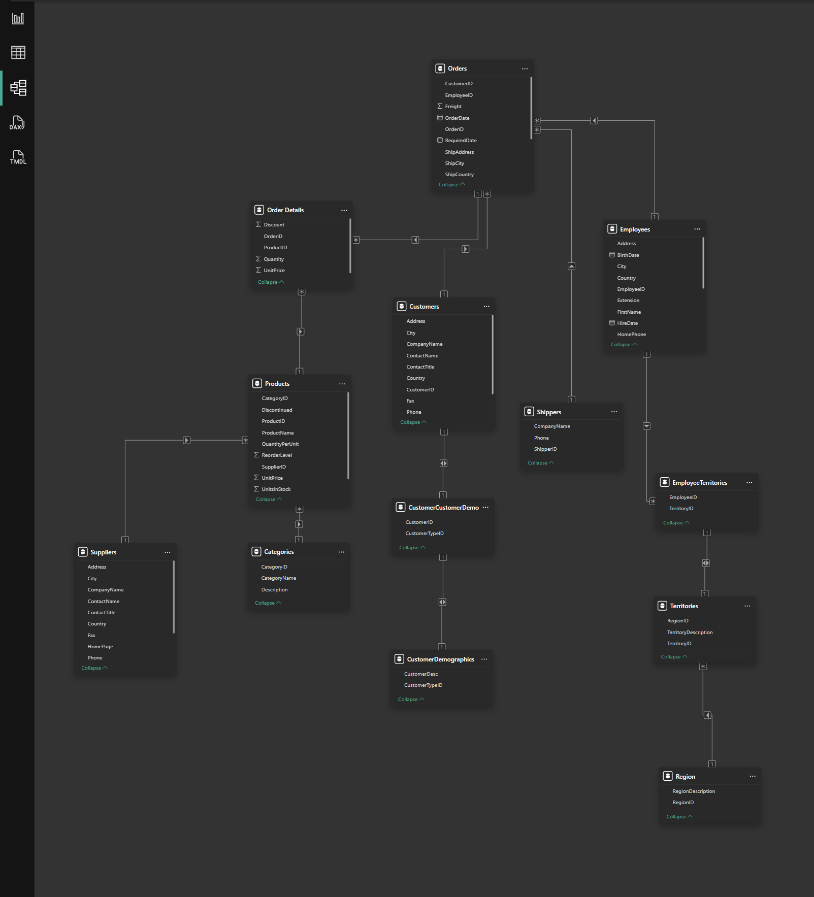

# SQL Analytics Portfolio
### Christian Lira Gonzalez · T-SQL · Python · dbt · Snowflake · PySpark

A 7-project end-to-end SQL analytics portfolio built on the Northwind database, 
covering advanced T-SQL patterns, cohort analysis, query optimization, 
dimensional modeling, dbt transformations, Snowflake migration, and PySpark each project delivered as a fully documented Quarto analytical report.

---

## Portfolio Overview

| # | Project | Topics | Stack | Status |
|---|---|---|---|---|
| 01 | [Vendor Sales Analytics](./01_vendor_sales_analytics/) | Supplier ranking · Category revenue · Window functions · Quadrant analysis | T-SQL · Python · pandas · matplotlib | ✅ Complete |
| 02 | [Cohort Retention Analysis](./02_cohort_retention/) | Enrollment cohorts · Completion rates · LAG() · Rolling averages | T-SQL · Python | 🔄 In Progress |
| 03 | [Query Optimization](./03_query_optimization/) | Execution plans · Index analysis · Performance tuning | T-SQL · SSMS | ⬜ Planned |
| 04 | [Star Schema + Power BI](./04_star_schema_design/) | Kimball methodology · Fact/dimension tables · DAX measures | T-SQL · Power BI | 🔄 In Progress |
| 05 | [dbt Models](./05_dbt_models/) | Staging → intermediate → mart · schema.yml · dbt tests | dbt · Snowflake | ⬜ Planned |
| 06 | [Snowflake Migration](./06_snowflake/) | Cloud DWH · Performance comparison · Snowflake SQL | Snowflake · Python | ⬜ Planned |
| 07 | [PySpark Extension](./07_pyspark/) | Distributed processing · DataFrame operations · Databricks | PySpark · Databricks | ⬜ Planned |

---

## Projects

### 01 · Vendor & Sales Analytics
**Stack:** T-SQL · Python · pandas · matplotlib · Quarto

Analyzes supplier revenue concentration, category-level rankings, monthly revenue trends with month-over-month growth rates and 3-month rolling averages, and fulfillment performance across shippers and employees. Uses a 3-CTE architecture, window functions including `RANK() OVER (PARTITION BY)`, `LAG()`, and rolling averages via `AVG() OVER (ROWS BETWEEN)`.


---

### 02 · Cohort Retention Analysis
**Stack:** T-SQL · Python · pandas · seaborn · Quarto

Segments customers into monthly enrollment cohorts and tracks retention rates over time to identify where drop-off occurs and which cohorts show the strongest
long-term engagement. Delivers a cohort heatmap as the primary analytical artifact.


---

### 03 · Query Optimization
**Stack:** T-SQL · SSMS 20

Takes existing analytical queries from Projects 01 and 02 and systematically
improves performance using execution plan analysis, index design, and query
restructuring. Documents before and after execution costs with concrete
performance improvements.

---

### 04 · Star Schema Design + Power BI
**Stack:** T-SQL · Power BI · DAX

Migrates the Northwind transactional OLTP structure to an analytical OLAP layer
using Kimball star schema methodology, designing fact and dimension tables,
implementing surrogate keys, and building Power BI semantic models with DAX
measures that enable self-serve analytics on top of the dimensional model.



---

### 05 · dbt Models
**Stack:** dbt · Snowflake · SQL

Implements a full dbt transformation layer on Northwind, staging models that
clean raw source data, intermediate models that apply business logic, and mart
models that deliver analytics-ready datasets. Includes schema.yml documentation,
dbt tests for data quality, and incremental model patterns.

---

### 06 · Snowflake Migration
**Stack:** Snowflake SQL · Python

Migrates the Northwind database from SQL Server to Snowflake, recreating the
schema, loading data, and rerunning analytical queries to document performance
differences between on-premise and cloud data warehouse environments.

---

### 07 · PySpark Extension
**Stack:** PySpark · Databricks · Python

Extends the supply chain analytics work from HackUSU 2026 into a structured
PySpark portfolio demonstrating distributed DataFrame operations, transformations, and aggregations on Northwind order and product data using the Databricks community edition.

---

## Technical Environment

Database:      SQL Server 2022 · Northwind Database
Query tool:    SSMS 20 · T-SQL
Python:        pandas · matplotlib · pyodbc · pathlib
Reporting:     Quarto (.qmd) · Journal theme · HTML output
Version ctrl:  Git · GitHub
Modern stack:  dbt · Snowflake · PySpark · Databricks


## Design Principles

**Analytical reports not just queries:** every project delivers a Quarto HTML report with executive summary, methodology, visualizations, and key findings.

**SQL in separate files:** queries live in `/sql/` folders, loaded via Python. 
SQL is treated as a first-class artifact, not embedded strings.

**CTE-first pattern:** complex logic broken into named steps. Each CTE does one thing. Readable, debuggable, maintainable.

**Business framing:** every chart and query answers a specific business question. Technical choices are explained in terms of the insight they enable.

---

## Setup

```bash
# Clone the repo
git clone https://github.com/ChristianLG2/SQL-Analytics-Portfolio.git

# Install Python dependencies
pip install -r requirements.txt

# Database: SQL Server 2022 + Northwind
# Connection: localhost, Trusted_Connection=yes
# See /setup/ for database installation instructions
```

---

## Author

**Christian Lira Gonzalez** · Analytics Engineer · Founder @ Orpheus Analytics

[](https://linkedin.com/in/christianlg)
[](https://clirago.com)
[](https://github.com/ChristianLG2)